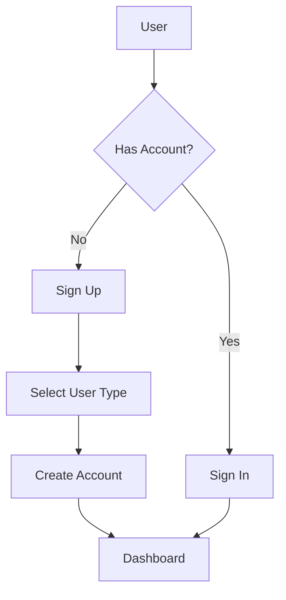

# System Patterns: DevLift

## Architecture Overview

DevLift follows a modern React-based frontend architecture with the following key patterns:

```
Frontend (React + TypeScript)
├── Authentication (Supabase Auth)
├── State Management (React Context API)
├── Routing (React Router)
├── UI Components (Custom + Tailwind CSS)
└── API Integration (Supabase Client)
```

## Component Architecture

The application follows a component-based architecture with a clear hierarchy:

```
App
├── Layout Components (Navbar, Footer)
├── Page Components
│   ├── Home
│   ├── SignIn/SignUp
│   ├── Dashboard (Student/Founder)
│   ├── Projects
│   ├── ProjectDetails
│   └── Profile
└── Common Components
    ├── Button
    ├── Card
    ├── Input
    └── Other UI elements
```

## State Management Pattern

DevLift uses React Context API for state management with specific contexts for different domains:

```
Contexts
├── AuthContext (user authentication state)
├── ProjectContext (projects data and operations) - Future
└── NotificationContext (system notifications) - Future
```

## Authentication Flow



## User Type Pattern

The application distinguishes between two user types with different experiences:

```
User
├── Student
│   ├── Browse Projects
│   ├── Apply to Projects
│   └── Build Portfolio
└── Founder
    ├── Create Projects
    ├── Review Applications
    └── Manage Projects
```

## Data Models

### User Profile
```
UserProfile {
  id: string (UUID)
  user_type: 'student' | 'founder'
  display_name: string
  bio: string
  location: string
  skills: string[] (for students)
  company: string (for founders)
  website: string (for founders)
  created_at: timestamp
  updated_at: timestamp
}
```

### Project
```
Project {
  id: string (UUID)
  founder_id: string (UUID)
  title: string
  description: string
  requirements: string
  skills_needed: string[]
  timeline: string
  status: 'open' | 'in_progress' | 'completed'
  created_at: timestamp
  updated_at: timestamp
}
```

### Application
```
Application {
  id: string (UUID)
  project_id: string (UUID)
  student_id: string (UUID)
  cover_letter: string
  status: 'pending' | 'accepted' | 'rejected'
  created_at: timestamp
  updated_at: timestamp
}
```

## UI Patterns

### Color System
- **Black**: Main background color (`bg-black`)
- **Custom Cyan** (`#19c3f7`): Primary accent color
- **Custom Purple** (`#7b2ff2`): Secondary accent color
- **Custom Orange** (`#f74a19`): Tertiary accent color
- **White**: For main text content

### Component Patterns
- Cards with dark backgrounds and subtle borders
- Buttons with vibrant accent colors
- Form inputs with dark backgrounds and accent-colored focus states
- Responsive layouts using grid and flex patterns
- Consistent spacing using Tailwind's spacing system

## Routing Pattern

```
Routes
├── / (Home)
├── /sign-in
├── /sign-up
├── /dashboard
├── /projects
├── /projects/:id
└── /profile
```

## Error Handling Pattern

1. Form validation using React Hook Form
2. API error handling with try/catch blocks
3. User-friendly error messages displayed in the UI
4. Fallback UI components for loading and error states

## Responsive Design Pattern

- Mobile-first approach using Tailwind's responsive classes
- Breakpoints: sm (640px), md (768px), lg (1024px), xl (1280px)
- Flexible layouts that adapt to different screen sizes
- Touch-friendly UI elements for mobile users 